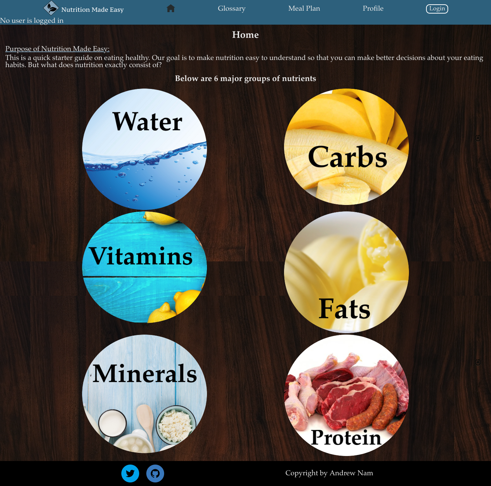
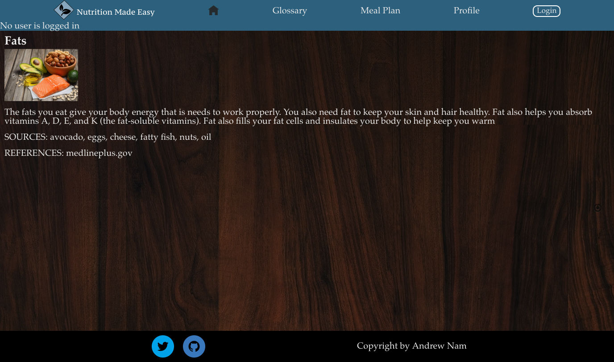
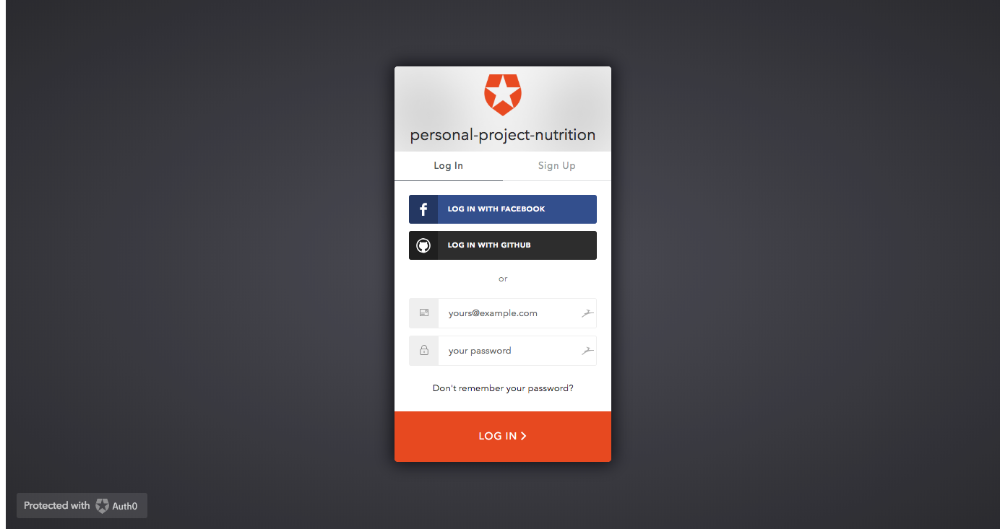
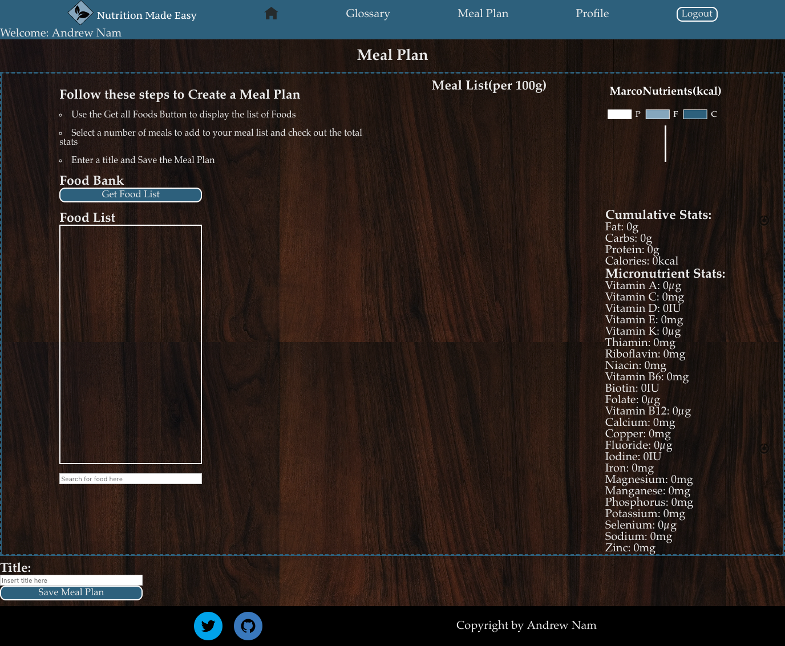
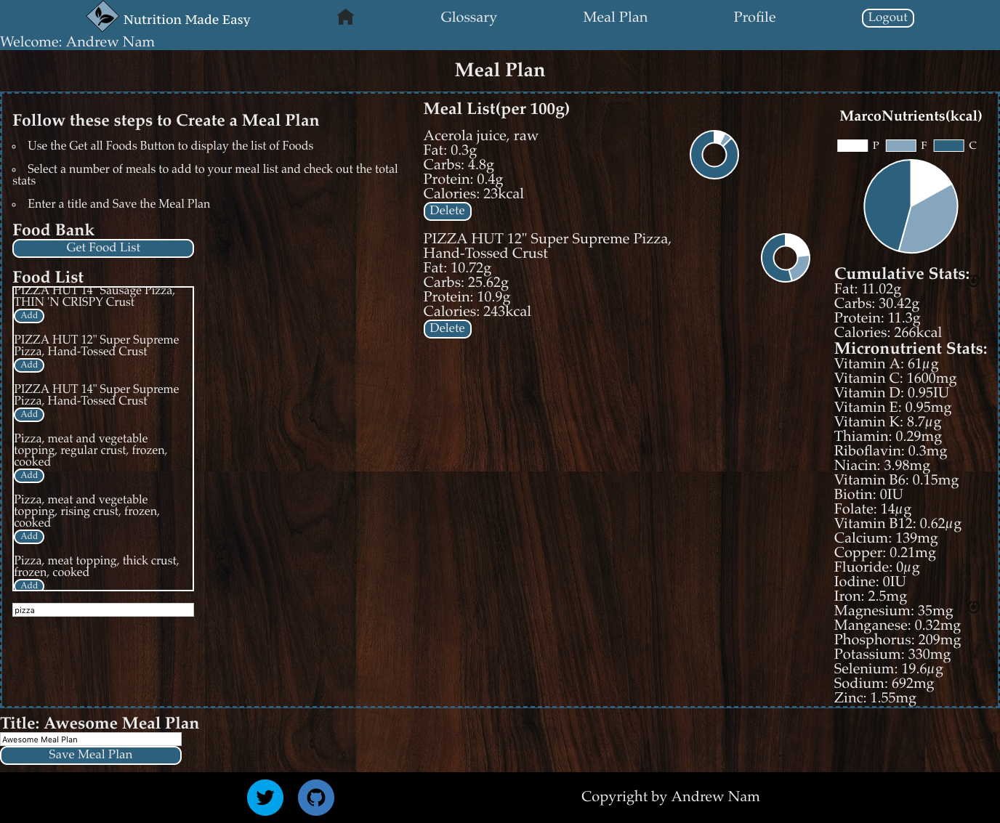
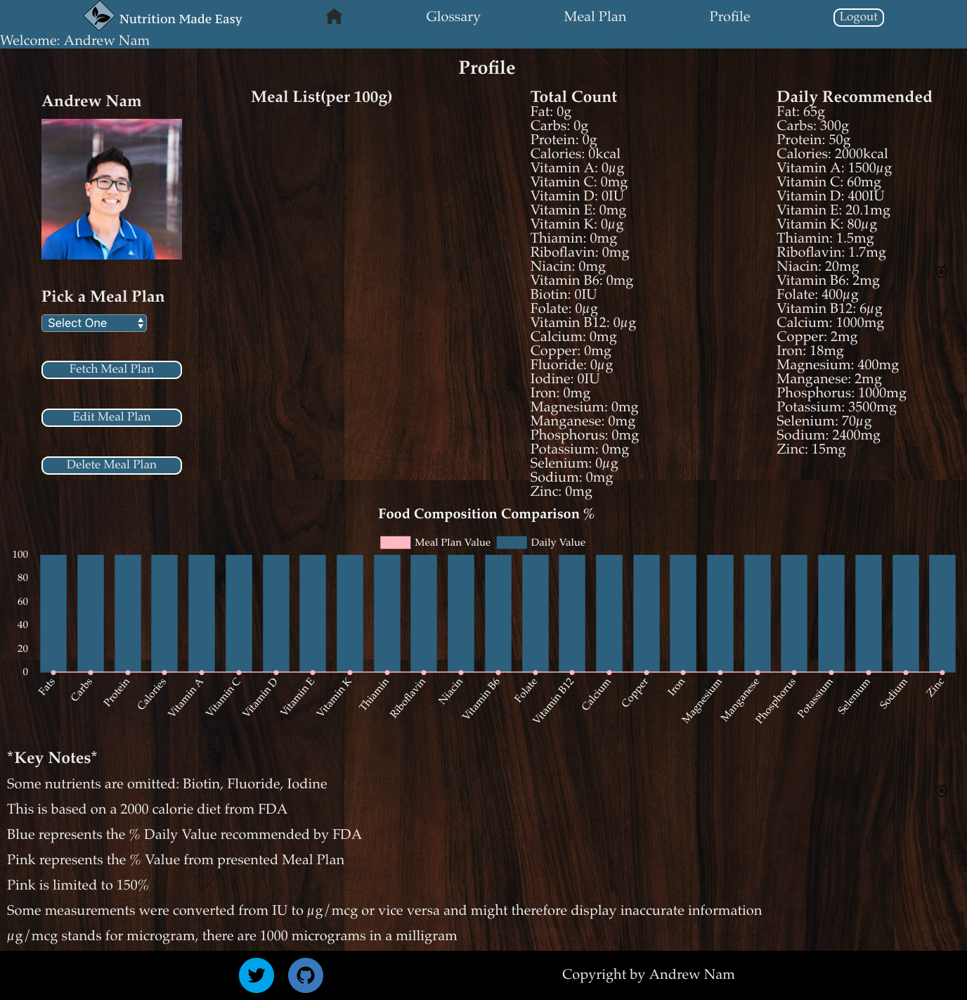
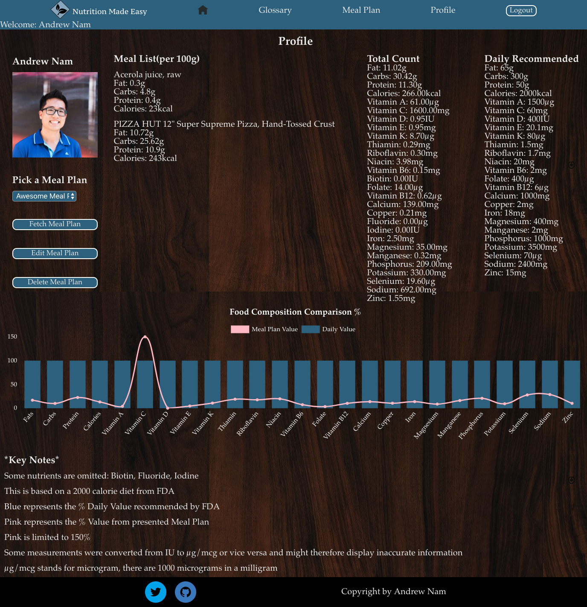

# NutritionMadeEasy 
**Link to Site: <a href="https://www.nutritionmadeeasy.us">Link</a>**
 
**Link to Trello: <a href="https://trello.com/b/LArcMVbE/nutrition-made-easy">Link</a>**

## About 
NutritionMadeEasy is a full stack application that creates meal plans based off of items pulled from the USDA nutrition API. Users are able to create, read, update, and delete mealplans. 

## Technologies / Libraries Used 
- Reactjs (Front-end Framework)
- Express (Server-side Framework for Nodejs)
- PostgreSQL (Relational Database) 
- Auth0 (Authentication)
- Axios (Fetch request library)
- Chartjs (Tool for displaying graphs/charts)
- Postman (Testing API/Endpoints)
- Redux (global state manager)
- Adobe XD (Design Layout & Wireframes)
- Trello (Task Manager [Lists of Tools Utilized in Web App])
- Sass (CSS Pre-processor)

## Hosting 
- Hosted on Digital Ocean 
- Nginx used for reverse proxy 
- PM2 used for running server persistently 

## Screenshots 
**Home Screen**

**Major Nutrition Group**

**Auth0 Login**

**Mealplan**
- Blank

- Filled

**Profile**
- Blank

- Filled

- Responsive

